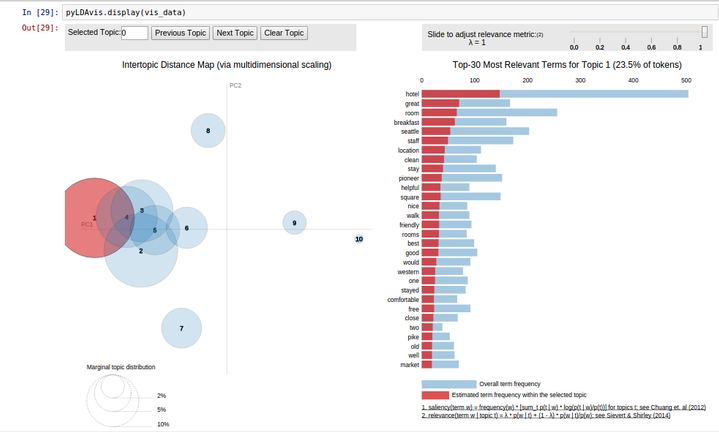

# topic-modeling-tripadv
Topic modeling of TripAdvisor hotel reviews ([Link](http://times.cs.uiuc.edu/~wang296/Data) to dataset). IPython [notebook](http://nbviewer.jupyter.org/gist/supercr7/733530249c06ecbf2689) for reference.

**Libraries used**

Used gensim (for [Latent Dirichlet Allocation](https://en.wikipedia.org/wiki/Latent_Dirichlet_allocation) model), nltk ([NLP](https://en.wikipedia.org/wiki/Natural_language_processing) library), [pyLDAvis](https://github.com/bmabey/pyLDAvis) (for topic model visualisation), pandas

**Topic Visualisation**

